# FIAP Lanches


> Sistema de autoatendimento para cantinas acadêmicas, com pedidos antecipados, controle de cardápio, fila digital e acompanhamento de status.

## 📌 Descrição do Problema

Atualmente, as cantinas universitárias enfrentam grande dificuldade com a alta demanda em curtos intervalos. Isso gera filas extensas, aumento do tempo de espera e estresse para os alunos, que possuem pouco tempo para se alimentar. Além disso, a falta de mão de obra encarece a operação e dificulta o atendimento eficiente, resultando em sobrecarga na equipe.

---

## 💡 Solução Proposta

O **FIAP Lanches** é um sistema web desenvolvido em **Python com Streamlit**, que simula um aplicativo de autoatendimento para cantinas acadêmicas.

A solução permite que o cliente:

- realize cadastro e login usando RM;
- consulte o cardápio;
- pesquise produtos;
- adicione itens disponíveis ao carrinho;
- escolha a forma de pagamento;
- finalize pedidos;
- acompanhe o status dos próprios pedidos.

Para o gerente, o sistema oferece um painel administrativo com:

- visualização da fila de pedidos em ordem de chegada;
- atualização do status dos pedidos;
- alteração da disponibilidade dos produtos;
- edição de preços;
- cadastro de novos produtos.

Os dados são armazenados em arquivos JSON, simulando um banco de dados local para usuários, cardápio e pedidos.

---

## 🆕 Evoluções do Checkpoint 1 para o Checkpoint 2

No Checkpoint 1, o projeto estava mais focado na definição da ideia, documentação inicial, requisitos e simulação conceitual do sistema.

No Checkpoint 2, o projeto evoluiu para uma aplicação funcional em Streamlit, com telas, fluxo de navegação, autenticação, carrinho, controle de pedidos e painel do gerente.

Principais evoluções implementadas:

- Migração da ideia inicial para uma aplicação funcional com interface web em Streamlit.
- Criação de uma arquitetura organizada em camadas:
 - `auth`
 - `models`
 - `services`
 - `views`
 - `data`
- Implementação de cadastro e login com RM.
- Validação de dados de cadastro e autenticação.
- Armazenamento de usuários, cardápio e pedidos em arquivos JSON.
- Criação da tela do cliente com:
 - busca de produtos;
 - visualização do cardápio;
 - botões de quantidade;
 - carrinho;
 - forma de pagamento;
 - acompanhamento de status.
- Criação da tela do gerente com:
 - fila de pedidos;
 - atualização de status;
 - alteração de preço;
 - alteração de disponibilidade;
 - cadastro de produto.
- Aplicação de identidade visual personalizada com cores inspiradas na FIAP.
- Atualização dos diagramas de Engenharia de Software:
 - Diagrama de casos de uso;
 - Diagrama de atividades;
 - Diagrama de classes;
 - Diagrama de sequência.
- Atualização do SRS com requisitos funcionais e não funcionais.
- Organização do projeto para versionamento no GitHub com branches, Pull Requests e commits convencionais.

---

## 🛠️ Tecnologias Utilizadas

| Tecnologia | Uso no Projeto |
|---|---|
| Python | Linguagem principal da aplicação |
| Streamlit | Criação da interface web |
| JSON | Persistência local de dados |
| HTML/CSS | Customização visual dentro do Streamlit |
| Git | Controle de versão |
| GitHub | Hospedagem do repositório e colaboração em equipe |
| Draw.io | Criação dos diagramas do sistema |
| Miro | Organização do projeto


## ⚙️ Como Executar

### Pré-requisitos

Antes de executar o projeto, é necessário ter instalado:

- Python 3.8 ou superior;
- Git;
- pip, gerenciador de pacotes do Python;
- navegador web atualizado.

Para verificar se o Python está instalado:
python --version

Clone o repositório:
git clone https://github.com/LeonardoVeleiro/fiap-lanches.git

Acesse a pasta: 
cd fiap-lanches


### Instalação
Instale as dependências:
pip install -r requirements.txt

### Execução
Execute o projeto com Streamlit: 
python -m streamlit run src/app.py

Usuários de teste
O sistema possui usuários cadastrados no arquivo src/data/usuarios.json.
Ou você pode cadastrar um usuário também

Cliente
RM: 559042
Senha: 1234
Perfil: cliente

Gerente
RM: 000000
Senha: 1234
Perfil: gerente

## 📁 Estrutura do Projeto

```text
fiap-lanches/
│
├── README.md
├── requirements.txt
│
├── docs/
│   ├── srs.py
│   └── diagramas/
│       ├── Diagrama de casos de uso.jpeg
│       ├── Diagrama de atividades.jpeg
│       └── Diagrama de classes.jpeg
│
└── src/
    ├── app.py
    │
    ├── auth/
    │   ├── cadastro_auth.py
    │   └── login_auth.py
    │
    ├── models/
    │   ├── usuario_model.py
    │   ├── produto_model.py
    │   ├── pedido_model.py
    │   └── pagamento_model.py
    │
    ├── services/
    │   ├── banco_service.py
    │   ├── cardapio_service.py
    │   ├── pedido_service.py
    │   └── gerente_service.py
    │
    ├── views/
    │   ├── tela_login.py
    │   ├── tela_cadastro.py
    │   ├── tela_cliente.py
    │   ├── tela_gerente.py
    │   └── tela_estilo.py
    │
    └── data/
        ├── usuarios.json
        ├── cardapio.json
        └── pedidos.json
```
## ✅ Funcionalidades Implementadas

### Cadastro e Login
Funcionalidades implementadas:
cadastro de novo usuário;
validação de campos obrigatórios;
validação de RM numérico;
validação de senha (maior que 4 dígitos);
confirmação de senha;
armazenamento de senha com hash SHA-256;
login com RM e senha;
controle de sessão com st.session_state;
separação de acesso por perfil:
cliente;
gerente.

### Cliente
Funcionalidades disponíveis para o cliente:
visualizar cardápio;
pesquisar produto por nome;
visualizar produtos disponíveis e indisponíveis;
adicionar e remover quantidade de produtos no carrinho;
impedir adição de produtos indisponíveis;
calcular total do carrinho;
escolher forma de pagamento;
finalizar pedido;
acompanhar o status dos pedidos realizados.

### Gerente
Funcionalidades disponíveis para o gerente:
visualizar fila de pedidos;
consultar pedidos em ordem de chegada;
marcar pedido como pronto;
visualizar dados do pedido;
visualizar itens do pedido;
alterar disponibilidade de produto;
alterar preço de produto;
cadastrar novo produto no cardápio.


### Casos de Uso

| Código | Caso de Uso | Status |
|---|---|---|
| UC01 | Cadastrar usuário | ✅ Implementado |
| UC02 | Fazer login | ✅ Implementado |
| UC03 | Consultar cardápio | ✅ Implementado |
| UC04 | Pesquisar item | ✅ Implementado |
| UC05 | Fazer pedido | ✅ Implementado |
| UC06 | Acompanhar status do pedido | ✅ Implementado |
| UC07 | Visualizar fila de pedidos FIFO | ✅ Implementado |
| UC08 | Atualizar status do pedido | ✅ Implementado |
| UC09 | Gerenciar cardápio | ✅ Implementado |
| UC10 | Alterar disponibilidade do produto | ✅ Implementado |
| UC11 | Alterar preço do produto | ✅ Implementado |
| UC12 | Cadastrar produto | ✅ Implementado |
| UC13 | Gerar relatórios | ❌ Não implementado |
| UC14 | Configurar horário de funcionamento | ❌ Não implementado |
| UC15 | Identificar unidade por geolocalização | ❌ Não implementado |
| UC16 | Processar pagamento | 🟡 Parcial / Simulado |
| UC17 | Repetir pedido anterior | ❌ Não implementado |

## ⭐ Diferencial do Projeto

### Arquitetura de Interfaces Independentes Orientada a Papéis  
**Role-Based UI / Multi-view Architecture**

O principal diferencial do **FIAP Lanches** é a separação da experiência do sistema de acordo com o perfil do usuário. A aplicação possui duas visões principais: uma voltada para o **Cliente**, representado por alunos e funcionários da faculdade, e outra voltada para o **Gerente**, representado pela equipe responsável pela operação da cantina.
Essa abordagem permite que cada perfil visualize apenas as funcionalidades necessárias para sua rotina, tornando o sistema mais seguro, organizado e intuitivo.

### Visão do Cliente

A interface do cliente é focada em **agilidade, simplicidade e facilidade de uso**. O objetivo é permitir que o usuário realize seu pedido de forma rápida, principalmente durante os intervalos das aulas.

### Visão do Gerente

A interface do gerente é voltada para **produtividade e controle operacional**. O objetivo é apoiar a equipe da cantina na organização da fila de pedidos e na administração do cardápio.

### Justificativa Técnica

A separação das telas do sistema por perfil de usuário foi adotada para tornar o projeto mais seguro, organizado e adequado ao uso real em uma cantina acadêmica.

#### Segurança e Controle de Acesso

Após o login, o sistema identifica se o usuário possui perfil de **Cliente** ou **Gerente** e libera apenas as funcionalidades correspondentes.
O cliente acessa recursos relacionados à compra, como cardápio, carrinho, finalização de pedido e acompanhamento de status. Já o gerente utiliza funcionalidades administrativas, como controle da fila de pedidos, alteração de status, edição de preços, alteração de disponibilidade e cadastro de produtos.
Essa divisão aplica o conceito de **Controle de Acesso Baseado em Papéis (RBAC)** e o **Princípio do Menor Privilégio**, pois cada usuário acessa somente os recursos necessários para sua função. Com isso, o sistema reduz o risco de acessos indevidos às áreas administrativas.

#### Organização da Arquitetura

A separação por perfil também melhora a organização interna do projeto. O sistema foi dividido em módulos, separando responsabilidades entre autenticação, telas, regras de negócio, models e persistência de dados.
Essa estrutura facilita a manutenção do código e permite que novas funcionalidades sejam adicionadas com menor impacto no restante da aplicação.
Além disso, essa organização favorece evoluções futuras. A área do cliente poderia ser adaptada para um aplicativo mobile ou PWA, enquanto o painel do gerente poderia evoluir para um dashboard administrativo mais completo.

#### Usabilidade e Experiência do Usuário

Do ponto de vista de **IHC (Interação Humano-Computador)**, cada perfil possui necessidades diferentes.
O cliente precisa de uma interface simples, rápida e objetiva para realizar pedidos em poucos minutos. Por isso, sua tela prioriza a busca de produtos, o carrinho e o acompanhamento do pedido.
O gerente, por outro lado, precisa de uma interface voltada para controle operacional. Sua tela prioriza a visualização da fila, a atualização de status e o gerenciamento do cardápio.
Dessa forma, o sistema reduz a complexidade visual, melhora a eficiência de uso e oferece uma experiência mais adequada para cada tipo de usuário.


### Referências de Pesquisa e Base Teórica

#### Segurança e Arquitetura

- **FERRAIOLO, D. F.; KUHN, D. R. — Role-Based Access Control**  
  Referência teórica para o conceito de controle de acesso baseado em papéis, utilizado para justificar a separação de permissões entre Cliente e Gerente.

- **OWASP — Broken Access Control**  
  As diretrizes da OWASP destacam a importância de restringir acessos indevidos e proteger funcionalidades administrativas contra usuários não autorizados.

#### Engenharia de Software e Organização Arquitetural

- **SOMMERVILLE, Ian — Engenharia de Software**  
  Referência para os conceitos de organização modular, separação de responsabilidades e manutenção de sistemas.

#### Usabilidade e IHC
- **NIELSEN, Jakob — 10 Heurísticas de Usabilidade para Design de Interface**  
  Referência para decisões relacionadas à eficiência de uso, simplicidade da interface e adaptação do sistema a diferentes perfis de usuário.

## 📊 Diagramas UML

### Diagrama de Casos de Uso


### Diagrama de Atividades


### Diagrama de Classes


### Diagrama de Sequência


## 📊 Diagramas UML

### Diagrama de Casos de Uso

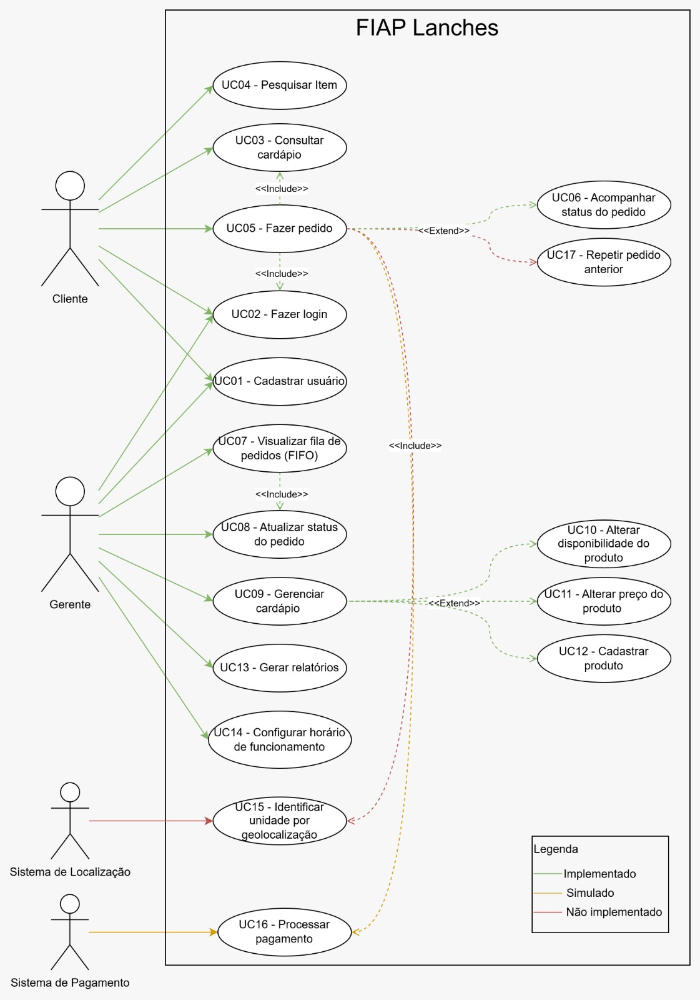

### Diagrama de Atividades

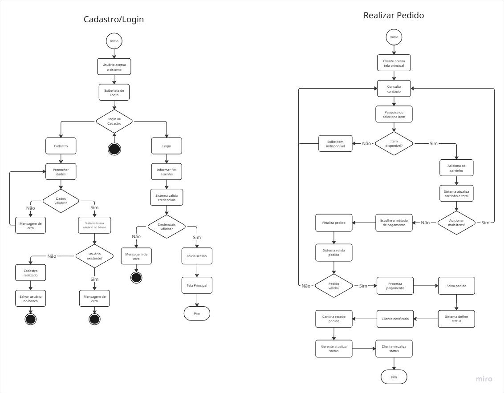

### Diagrama de Classes

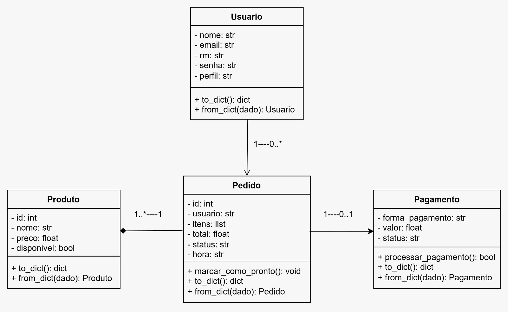

### Diagrama de Sequência

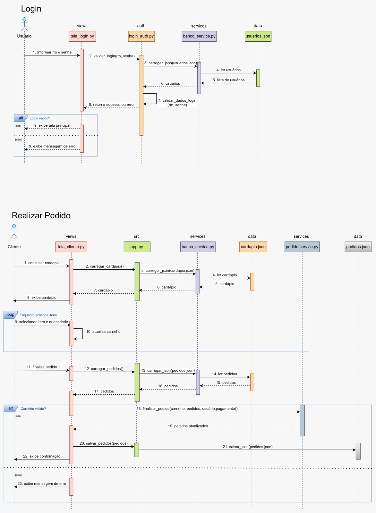

## 👥 Integrantes do Grupo
- Agatha Cassari
- Gustavo Cheng
- Leonardo Veleiro
- Sara Barbosa

## 📸 Demonstração

## 📸 Prints do Sistema

### Tela de Login

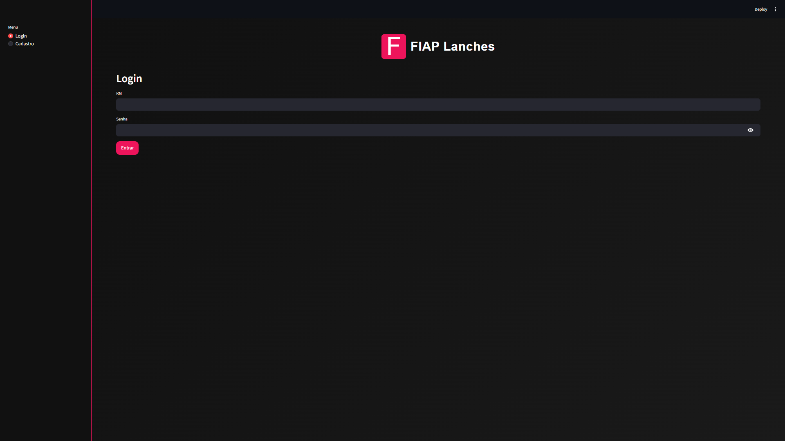

### Tela de Cadastro

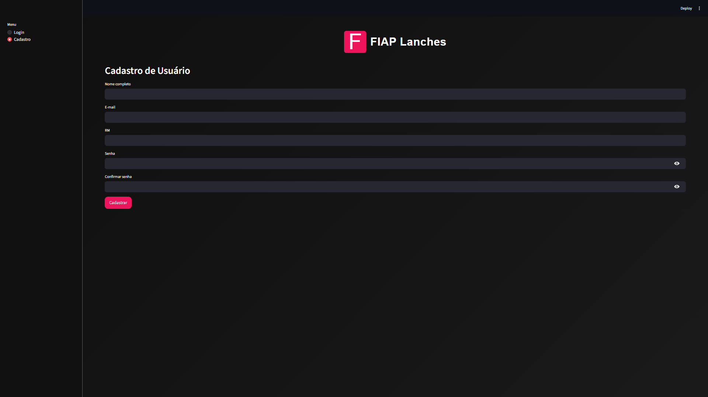

### Tela do Cliente

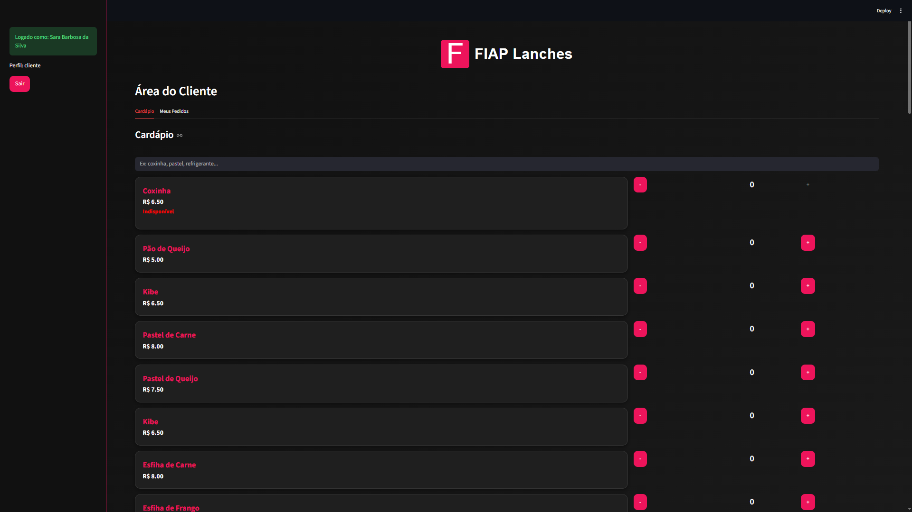

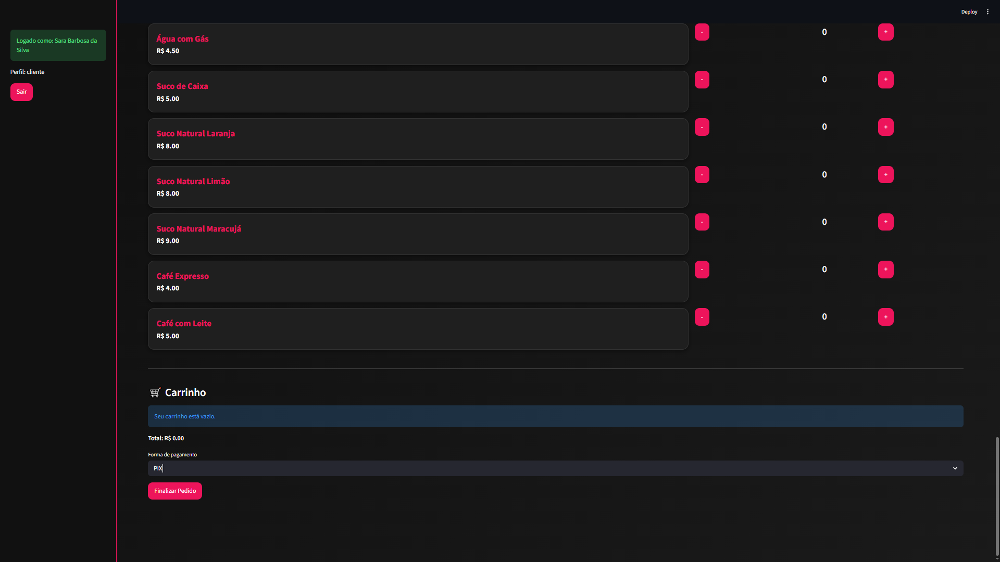

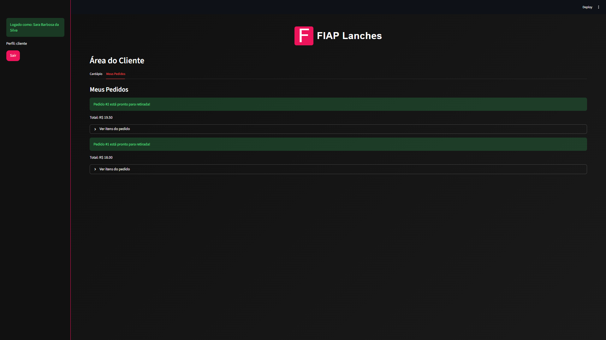

### Tela do Gerente

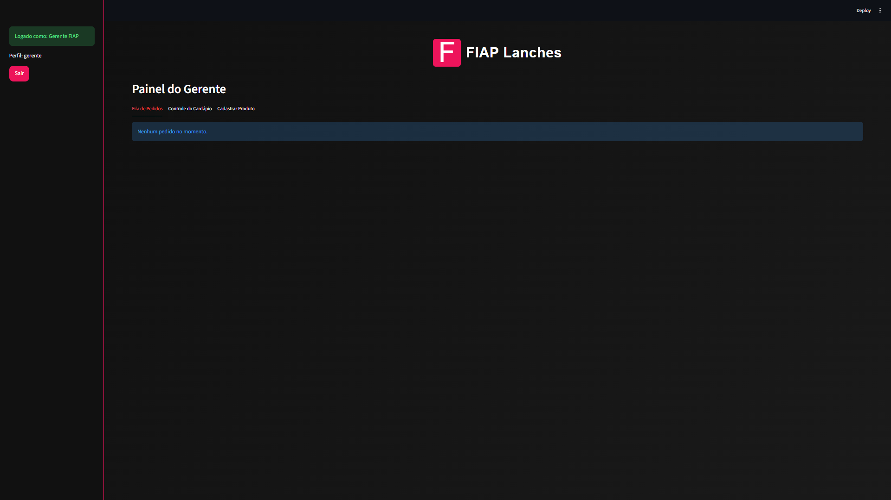

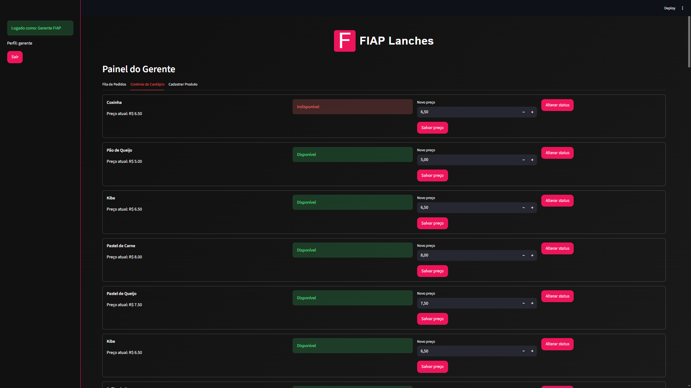

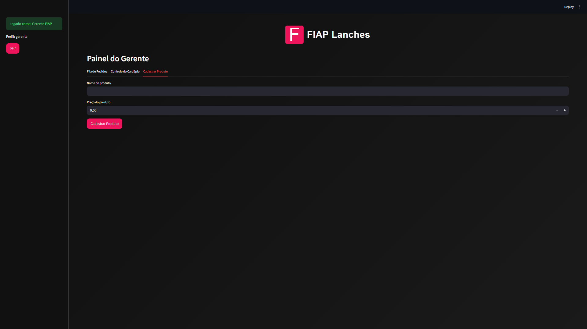

## 🔗 Links 

🎨 Board no Miro (Diagramas e Planejamento): [Acessar Miro](https://miro.com/app/board/uXjVGwHZNKQ=/?share_link_id=717889814021)
🎥 Vídeo no YouTube (Demonstração do Projeto): [Assistir vídeo](https://www.youtube.com/watch?si=NtN_UA9VQvPr9ULT&v=m__FHAk--Tg&feature=youtu.be)

